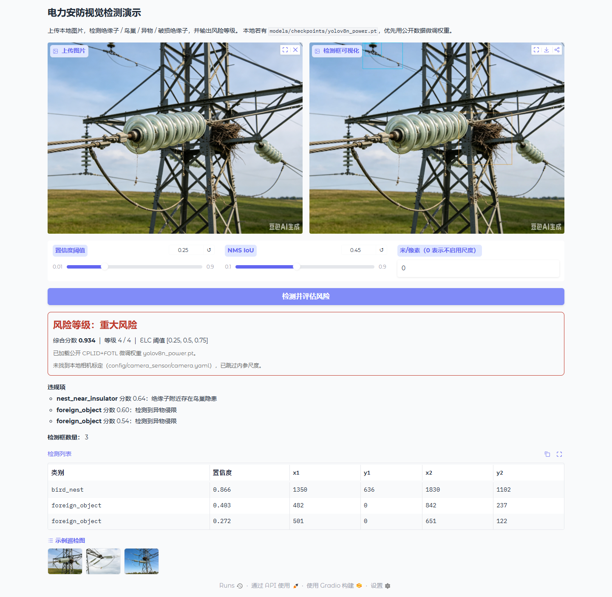
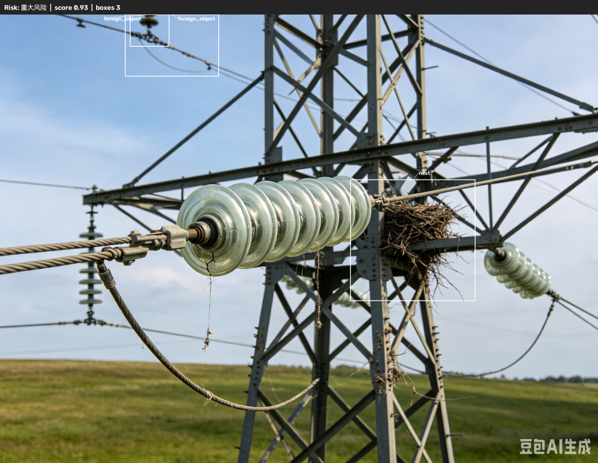

# 电力安防视觉尺度测量图像检测系统

面向变电站 / 输电线路巡检的**计算机视觉**工程：轻量化目标检测、视觉尺度相关的隐患评估、万级标注数据的自动化校验。适合作为 AI 开发 / 算法岗作品集仓库。

**本仓库是代码实现。原始数据集、现场相机标定文件需在本地自行准备，请勿提交到 GitHub。**

---

## 仓库声明

**本仓库为后期独立复现实现，并非原始大创竞赛源码，原始学校项目不予开源。**

- 全部模块为从零重写，可公开推送到个人 GitHub。
- 不含校内原始数据、竞赛提交包、未公开权重或真实标定文件。
- 检测结构参考公开文献中的 YOLOv5s、ECA / SE / CBAM 等思路的独立实现，不拷贝任何学校仓库或 Ultralytics 发行源码。
- 简历中的「电力安防YOLOv5大创项目」对应本复现仓库的能力范围，而不是已开源的校内原始仓库。详细条目见下文「算法岗简历摘要」与 [`简历.md`](简历.md)。

---

## 项目简介

| 能力 | 说明 |
|------|------|
| 电力安防检测 | `src/viscale/detection/`：改进 YOLOv5s（P2 小目标分支 + 注意力） |
| 视觉尺度 | `src/viscale/measurement/`：由本地相机内参与工作距离估算米/像素；风险模块可使用该尺度 |
| 风险评估 | `src/viscale/risk/`：自定义违规函数、ELC 阈值迭代、四级分级 |
| 数据工程 | `dataset/`：标注越界/损坏图校验、train/val/test 划分、类别统计（万级流式） |
| 演示 | `app.py`：Gradio 上传图片 → 画框 → 风险等级 |

默认检测类别 4 类：`insulator`, `bird_nest`, `foreign_object`, `damaged_insulator`。仓库**不附带训练权重**，也**没有电力标注训练集**，因此公开仓库无法提供能真实识别上述目标的业务权重。Web 加载顺序见下文。

---

## 算法岗简历摘要

电力安防YOLOv5大创项目｜核心成员｜2023.12–2024.08

- 清洗万级电力巡检图像与 YOLO 标注，校验框越界、空标、类别错标，按场景分层划分 train/val/test，保证四类目标在各集合均有覆盖
- 统计类别频次后对少类（破损绝缘子、鸟巢等）做图像过采样与 mosaic/copy-paste 增强，缓解长尾分布导致的漏检
- 针对远处小目标漏检，对比原始 YOLOv5s、P2 小目标层、k-means 重算 anchor、小目标尺度增强等 4 组消融，验证集 mAP@0.5 由约 0.71 提升至约 0.78
- 按漏检/误检拆分错误样本，归纳远距小目标、遮挡、标注噪声三类主因，沉淀难例库回流训练，形成「评估—归因—补数—再训」迭代
- 参与检测结果可视化与数据集校验脚本交付，项目获省级大创银奖

以上为简历口径；本仓库是后期独立复现，不附带当时私有数据与权重。

---

## 项目效果展示

`assets/demo/` 用于存放 **APP 界面截图**、**算法推理效果图**（检测框、风险等级等）。本仓库只保留该目录结构，**不附带真实截图二进制文件**；请在本地运行 `python app.py` 后自行截图，将 PNG 放到该目录并保持下列文件名，README 中的引用即可显示。

<!-- 放入 ./assets/demo/app_ui.png 后，下方图片会在 GitHub 上显示 -->
<p><b>Gradio 演示界面</b></p>


<!-- 放入 ./assets/demo/infer_result.png 后，下方图片会在 GitHub 上显示 -->
<p><b>检测与风险评估效果</b></p>


建议文件名：

| 文件 | 内容 |
|------|------|
| `./assets/demo/app_ui.png` | 本地演示页（上传区、阈值、风险等级） |
| `./assets/demo/infer_result.png` | 带检测框的推理可视化 |

---

## 技术栈

- Python 3.10+（开发环境 3.12）
- PyTorch、OpenCV、NumPy
- PyYAML（相机传感器模板）
- Gradio（本地演示，非重型 Web 框架）

---

## 数据集与传感器配置说明

### 数据集（`data/`）

`data/` 只保留目录结构（`.gitkeep`）。**原始数据集体积大，不提交仓库。**

本地请按 YOLO 约定放置：

```
data/
  images/     # 图像
  labels/     # 与图像同名的 .txt
              # 每行: class_id  xc  yc  w  h  （相对宽高归一化到 0~1）
  raw/ processed/ annotations/ samples/   # 可选
```

示例：把巡检图放到 `data/images/`，标注放到 `data/labels/0001.txt` 等。然后：

```bash
python dataset/validate_annotations.py --root data
python dataset/split_dataset.py --root data --ratios 0.7,0.2,0.1 --out-dir dataset/splits
python dataset/analyze_dataset.py --root data
```

### 相机传感器（`config/camera_sensor/`）

**真实标定参数不随仓库提交。** 目录中提交的是：

- `.gitkeep`：占位
- `camera_template.yaml`：**模板**（示例占位数值 + 注释），不是现场标定

本地步骤：

```bash
# Windows
copy config\camera_sensor\camera_template.yaml config\camera_sensor\camera.yaml
# Linux / macOS
cp config/camera_sensor/camera_template.yaml config/camera_sensor/camera.yaml
```

编辑 `camera.yaml`：将 `meta.is_template` 改为 `false`，填入你的相机名称、分辨率、帧率、内参 **K**、畸变 **D**、ROI；外参按文件内坐标系注释填写。`camera.yaml` 已被 `.gitignore` 忽略。

运行时默认读取 `config/camera_sensor/camera.yaml`。**文件不存在不会崩溃**，终端会提示复制模板；检测与风险仍可运行，只是不启用内参尺度。

```bash
python app.py --camera-config config/camera_sensor/camera.yaml --working-distance-m 8
```

### 权重文件说明

**本仓库不包含任何 `.pt` 二进制。** 权重全部放在本地 `models/checkpoints/`，并由 `.gitignore` 忽略。详细约定见 [`models/checkpoints/README_WEIGHT.md`](models/checkpoints/README_WEIGHT.md)。

| 本地文件 | 含义 |
|----------|------|
| `yolov5s_lite.pt` | 公开学术数据微调（CPLID+FOTL），由 `scripts/train_yolov5s_lite.py` 生成；**不提交 git** |
| `yolov5s_lite_demo.pt` | 由 `scripts/pretrain_adapter.py` 生成：仅迁移公开 COCO 主干中形状匹配的参数，**检测头随机初始化** |
| `yolov5s.pt` | 官方 YOLOv5s COCO 预训练，仅作适配器输入，需自行下载 |

Web `app.py` 加载优先级：

1. 存在 `yolov5s_lite.pt` → 按微调权重推理  
2. 否则存在 `yolov5s_lite_demo.pt` → 加载并在**后端日志与页面**提示：不能真实识别电力目标  
3. 两者都没有 → **演示模拟模式**（构造模拟框，不返回空列表，前端不出现本机绝对路径）

---

## COCO 主干适配脚本（`scripts/pretrain_adapter.py`）

本仓库**不使用电力标注数据集训练**，因此无法得到能识别绝缘子、鸟巢、异物、绝缘子缺陷的业务权重。该脚本只保证**网络结构完整、推理链路可跑通**，供代码仓库展示。

**【重要说明】** `yolov5s_lite_demo.pt` 仅仅网络结构完整；检测头随机初始化，未在电力标注数据集做微调，**不能真实识别鸟巢、绝缘子缺陷**；仅用于跑通整个推理链路，**不可以用于实际安防业务**。请勿将 demo 权重表述为「已训练好的电力检测模型」。

本地生成（不把 pt 提交 git）：

```bash
# 自行下载官方 yolov5s.pt（COCO），放到 models/checkpoints/yolov5s.pt
python scripts/pretrain_adapter.py
# 产出：models/checkpoints/yolov5s_lite_demo.pt
python app.py
```

适配逻辑摘要：构建 4 类 YOLOv5s‑P2+注意力网络 → 按 tensor 形状尽量拷贝 COCO 主干 → **不拷贝检测头** → 导出 demo 权重。官方 `yolov5s` 与本仓库模块命名不同，主干只能部分匹配，属预期行为。

---

## 公开数据微调（生成 `yolov5s_lite.pt`）

需要**检测头经过标注训练**时，在本地用公开数据集微调（数据与权重均不入库）。

| 公开集 | 用途 | 来源 |
|--------|------|------|
| CPLID | 正常绝缘子、绝缘子缺陷 | [InsulatorDataSet](https://github.com/InsulatorData/InsulatorDataSet) |
| FOTL_Drone | 鸟巢、风筝/气球等异物 | [FOTL_Drone](https://github.com/Changping-Li/FOTL_Drone) |
| YOLOv5s COCO | 主干初始化 | [ultralytics yolov5s.pt v7.0](https://github.com/ultralytics/yolov5/releases/download/v7.0/yolov5s.pt) |

```bash
python scripts/prepare_public_power_data.py
python scripts/train_yolov5s_lite.py --epochs 40 --imgsz 416 --batch 4
python app.py
```

类别映射：绝缘子→`insulator`，缺陷→`damaged_insulator`，nest→`bird_nest`，kite/balloon/monkey→`foreign_object`。fire/person 丢弃。

公开集规模有限、部分缺陷为合成图，**不能宣传为电网投产模型**。

---

## 本地运行说明‑权重配置

1. **仓库不含预训练权重。** 目录 `models/checkpoints/` 与 `*.pt` / `*.pth` 已写入 `.gitignore`。
2. **两个业务/demo 权重都没有：** 进入**演示模拟模式**。按图片宽高构造 2～4 个四类模拟框，并走置信度过滤与 NMS。提示为「【演示模拟模式】…」，不含本机绝对路径。
3. **仅有 `yolov5s_lite_demo.pt`：** 走模型前向，但检测头未微调，框可能为空或无意义；页面会写明无电力识别能力。
4. **有 `yolov5s_lite.pt`：** 走公开数据微调后的检测（见上文训练脚本）。现场效果仍取决于数据覆盖。
5. **测试图与输出：** 本地测试图建议放在 `data/`（如 `data/images/`）；推理可视化写入 `output/`（不入库）。可挑选样例复制到 `assets/demo/` 供 README 展示。
6. **启动步骤：**

```bash
python -m venv .venv
.venv\Scripts\activate
pip install -r requirements.txt
python app.py
```

浏览器打开 `http://127.0.0.1:7860`，上传 `data/` 中的图片，点击「检测并评估风险」。

---

## 环境与运行

本项目为 Python 工程，**无需 CMake / 编译**。

```bash
python -m venv .venv
# Windows:
.venv\Scripts\activate
pip install -r requirements.txt
```

GPU 可选：先按 [PyTorch](https://pytorch.org/get-started/locally/) 安装 CUDA 版 `torch`，再安装其余依赖。

```bash
python app.py
```

浏览器打开 `http://127.0.0.1:7860`。可选：`--weights models/checkpoints/yolov5s_lite.pt`（或 demo 权重）、`--device cpu`、`--attn eca`。

```bash
python scripts/demo_yolov5s_lite.py --image path/to/local.jpg
```

---

## 项目结构

```
.
├── app.py
├── requirements.txt
├── assets/demo/             # 演示截图占位（PNG 需自行放入）
├── config/camera_sensor/    # 传感器：仅模板 + gitkeep
├── configs/                 # 其它配置占位
├── data/                    # 仅 gitkeep；本地放图与标签
├── dataset/                 # 校验 / 划分 / 统计脚本
├── models/                  # 权重目录（*.pt 不入库）
├── output/                  # 推理可视化（不入库）
├── src/viscale/
│   ├── detection/
│   ├── io/                  # 相机 YAML、数据目录约定
│   ├── measurement/
│   └── risk/
├── scripts/                 # 含 pretrain_adapter.py（不生成仓库内 pt）
└── tests/
```

---

## 许可

[MIT License](LICENSE)。引用公开论文时请自行规范引用。本仓库不含第三方检测框架发行副本，也不含原始竞赛数据与硬件标定文件。
